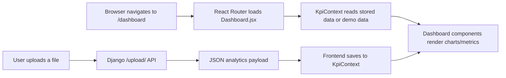
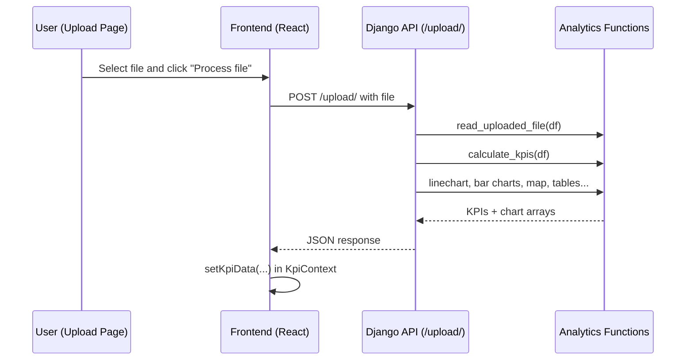
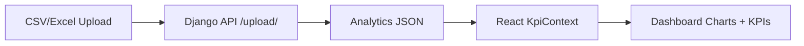

# Dashboard Walkthrough (Backend → Frontend)

This document explains how the dashboard works end‑to‑end in this project.
It is written for beginners with basic Python and Django knowledge.

---

## 1) Big Picture Flow (URL → View → Data → UI)

In this project, **Django is the API backend**, and **React renders the UI**.
So the "dashboard page" is **not** a Django template. It is a React route.

---

## 2) URLs (Django)

**File:** `backend/backend/urls.py`  
Role: Defines Django endpoints.

Key URL used for the dashboard data:
- `POST /upload/` → accepts CSV/Excel, returns analytics JSON

There is **no Django `/dashboard/` URL**, because the dashboard UI is built in React.

---

## 3) Views (Django)

**File:** `backend/backend/api/views.py`  
Role: Handle file upload, compute analytics, return JSON.

High‑level steps inside the upload view:
1. Read the uploaded file into a DataFrame.
2. Detect the date column.
3. Optionally filter by a date range.
4. Calculate KPIs and chart data.
5. Return a JSON payload.

---

## 4) Models (Django)

This project **does not use Django models** for the dashboard.
The data comes from uploaded files, not stored in a database table.

---

## 5) Templates (Django)

There is **no `dashboard.html` template** in this project.
The dashboard UI is rendered in React:

**File:** `frontend/src/pages/Dashboard.jsx`

---

## 6) JavaScript / AJAX (Frontend)

**File:** `frontend/src/pages/Upload.jsx`  
Role: Sends the file to Django and stores the response in the frontend context.

Key idea:
- The JSON response from Django becomes **global state** (`KpiContext`).
- Dashboard components read data from that state.

---

## 7) How Data Moves (DB → View → Template → UI)

Since there is no database model, the data flow is:

---

## 8) Dashboard Components (Frontend)

**File:** `frontend/src/pages/Dashboard.jsx`  
Role: Main UI that composes all dashboard widgets.

It renders:
- `DashboardMetrics` (KPI cards + gauge)
- `LineChart`
- `OrdersComparisonBarChart`
- `DashboardMultilineChart`
- `BarChart`
- `MapChart`
- `TopProfitTable`

Each component reads from `KpiContext` to display analytics.

---

## 9) Charts and KPI Examples

### Example: KPI Metrics
**File:** `frontend/src/features/DashboardMetrics/DashboardMetrics.jsx`
- Reads `kpiData.profit_sum` and `kpiData.revenue_sum`.
- Computes a profit margin and shows it on a gauge.

### Example: Multi‑Line Chart
**File:** `frontend/src/features/DashboardMultilineChart/DashboardMultilineChart.jsx`
- Uses arrays like `multiline_labels`, `multiline_revenue`, `multiline_orders`.
- Falls back to `date_data` / `revenue_data` if needed.

---

## 10) Filters / Timeline Buttons

On the **dashboard page**, there is a date range picker UI.
Currently it **only updates local UI state**, it does **not** call the backend.

So:
- Changing the date range updates the label.
- The chart data stays the same unless you upload a new file.

If you want date range filtering to affect the dashboard data,
you would need to **send `start_date` and `end_date` to Django**,
then replace `kpiData` with the filtered results.

---

## 11) Initial Load Behavior

1. React loads `/dashboard`.
2. `KpiContext` checks localStorage.
3. If no uploaded data exists, it loads demo data.
4. Components render immediately.

---

## Architecture Summary (Short)

- **Django** = data engine (file upload → analytics JSON)
- **React** = UI renderer (charts + KPIs)
- **KpiContext** = shared state between pages
- **Dashboard page** = a React route (not a Django template)

---

If you want, I can add:
- a deeper breakdown of each chart component
- a guide to make dashboard filters update data via the backend
`