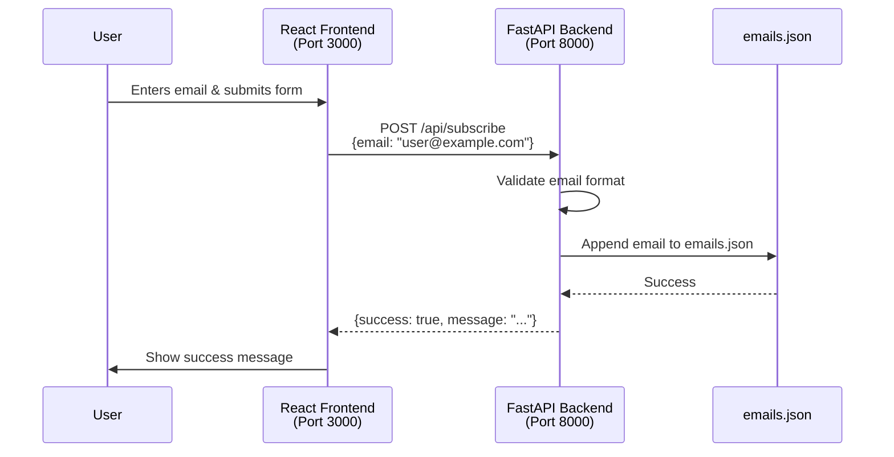

# Connect FastAPI Backend to Landing Page

## Overview

This plan will connect your FastAPI backend to the React landing page so that when users submit their email addresses on the ComingSoon page, the data is sent to and stored by your backend API.

## Architecture Flow

## Implementation Steps

### 1. Backend: Add CORS Middleware

**File**: [`backend/app.py`](backend/app.py)

**Why CORS?** When your frontend (running on `http://localhost:3000`) tries to call your backend (running on `http://localhost:8000`), browsers block these "cross-origin" requests by default. CORS (Cross-Origin Resource Sharing) middleware tells the browser to allow these requests.

**Changes**:
- Import `CORSMiddleware` from `fastapi.middleware.cors`
- Add CORS middleware to allow requests from the frontend origin
- Configure allowed origins, methods, and headers

### 2. Backend: Create Email Subscription Endpoint

**File**: [`backend/app.py`](backend/app.py)

**What we're building**: A POST endpoint that receives email addresses, validates them, and stores them in a JSON file.

**Changes**:
- Import Pydantic models for request validation (`BaseModel` from `pydantic`)
- Import JSON and file handling utilities
- Create a `SubscribeRequest` model with email validation
- Create `POST /api/subscribe` endpoint that:
  - Validates the email format
  - Reads existing emails from `emails.json` (create file if it doesn't exist)
  - Checks for duplicates
  - Appends new email with timestamp
  - Returns success/error response

### 3. Backend: Add Error Handling

**File**: [`backend/app.py`](backend/app.py)

**Why?** Proper error handling ensures the API returns meaningful messages when something goes wrong (invalid email, file errors, etc.).

**Changes**:
- Add try-except blocks around file operations
- Return appropriate HTTP status codes (200 for success, 400 for bad requests, 500 for server errors)
- Include descriptive error messages

### 4. Frontend: Create API Service Module

**File**: [`frontend/src/services/api.js`](frontend/src/services/api.js) (new file)

**Why a separate service file?** This keeps API logic organized and reusable. It's a common pattern in React apps.

**What to create**:
- A function `subscribeEmail(email)` that:
  - Makes a POST request to `http://localhost:8000/api/subscribe`
  - Handles the response
  - Returns a promise with success/error information

**Note**: We'll use the browser's built-in `fetch` API (no extra dependencies needed).

### 5. Frontend: Connect Form to Backend

**File**: [`frontend/src/pages/ComingSoon.jsx`](frontend/src/pages/ComingSoon.jsx)

**Changes**:
- Import the `subscribeEmail` function from the API service
- Update `handleSubmit` to:
  - Call the API function
  - Show loading state while waiting for response
  - Display success message on success
  - Display error message on failure
  - Handle network errors gracefully

### 6. Backend: Update Requirements

**File**: [`backend/requirements.txt`](backend/requirements.txt)

**Changes**:
- Add `pydantic[email]` for email validation (if not already included with FastAPI)

### 7. Create Data Storage File

**File**: [`backend/emails.json`](backend/emails.json) (new file, initially empty array)

**Purpose**: This JSON file will store all collected email addresses with timestamps.

**Initial content**: `[]`

## Key Concepts Explained (For Learning)

### CORS (Cross-Origin Resource Sharing)

- **Problem**: Browsers prevent JavaScript from making requests to different origins (different protocol, domain, or port) for security
- **Solution**: Backend sends special headers telling the browser "it's okay, allow requests from this origin"
- **In FastAPI**: We use `CORSMiddleware` to automatically add these headers

### API Endpoints

- **GET**: Retrieve data (like `/health` - checking if server is alive)
- **POST**: Send/create data (like `/api/subscribe` - sending email to be stored)
- **Request Body**: Data sent from frontend to backend (in our case, the email address)
- **Response**: Data sent back from backend to frontend (success/error message)

### Async/Await in FastAPI

- FastAPI endpoints are `async` functions, meaning they can handle multiple requests efficiently
- We use `await` when doing file I/O operations (reading/writing files)

### Error Handling

- **Client Errors (400)**: Bad data from user (invalid email format)
- **Server Errors (500)**: Something went wrong on the server (file permissions, disk full)
- **Network Errors**: Connection issues (handled on frontend)

## Testing the Connection

After implementation:

1. Start backend: `cd backend && uvicorn app:app --reload --port 8000`
2. Start frontend: `cd frontend && npm run dev`
3. Submit an email on the landing page
4. Check `backend/emails.json` to see the stored email
5. Check browser console for any errors

## Next Steps (Future Enhancements)

- Add email validation on backend (check format, check if domain exists)
- Add rate limiting (prevent spam)
- Move to a real database (PostgreSQL, MongoDB)
- Add email confirmation (send verification email)
- Add analytics endpoint (count total subscriptions)

